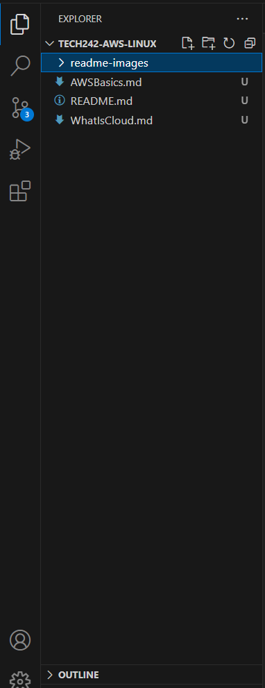

# Week 1 - AWS and Linux

- [Week 1 - AWS and Linux](#week-1---aws-and-linux)
  - [Day 1 - Intro to cloud and AWS](#day-1---intro-to-cloud-and-aws)
  - [Day 2](#day-2)
  - [How to change directory in Linux](#how-to-change-directory-in-linux)


## Day 1 - Intro to cloud and AWS
[Title](AWSBasics/README.md) <br>
  - point 1
  - point 2
[What is Cloud](WhatIsCloud/README.md)


## Day 2 



## How to change directory in Linux

change directory using this command: `cd <directory>` 
Change directory using this command:
```
cd<directory>
<other commands>

```