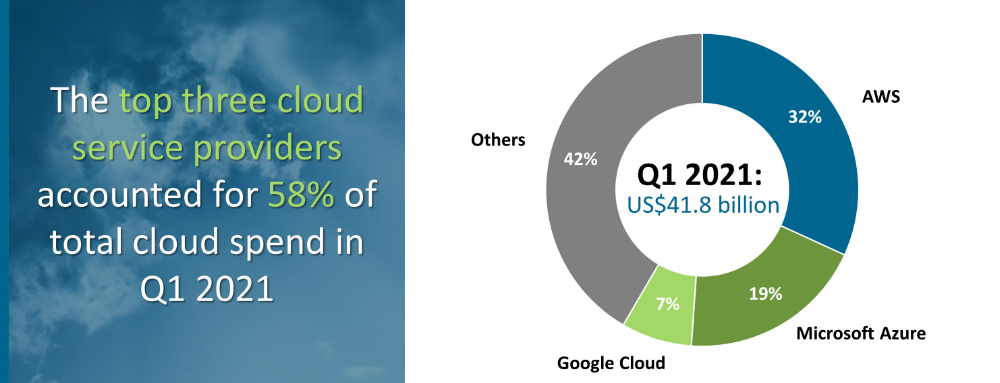

# What is cloud
- [What is cloud](#what-is-cloud)
  - [Introduction](#introduction)
  - [What is the Cloud](#what-is-the-cloud)
  - [History of cloud](#history-of-cloud)
  - [Uses of Cloud](#uses-of-cloud)
      - [Data Storage](#data-storage)
      - [Application hosting](#application-hosting)
      - [Collaboration and Communication](#collaboration-and-communication)
      - [Development and Testing Environments](#development-and-testing-environments)
      - [Big Data Analytics](#big-data-analytics)
      - [IoT (Internet of Things) Applications](#iot-internet-of-things-applications)
      - [Disaster Recovery and Business Continuity](#disaster-recovery-and-business-continuity)
      - [Content Delivery and Streaming](#content-delivery-and-streaming)
      - [Artificial Intelligence and Machine Learning](#artificial-intelligence-and-machine-learning)
  - [4 Types of Cloud Computing](#4-types-of-cloud-computing)
      - [Infrastructure as a service (IaaS) -](#infrastructure-as-a-service-iaas--)
      - [Platform as a service (PaaS)](#platform-as-a-service-paas)
      - [Software as a service (SaaS)](#software-as-a-service-saas)
      - [Function as a service Serverless computing](#function-as-a-service-serverless-computing)
  - [What are the different types of cloud service?](#what-are-the-different-types-of-cloud-service)
  - [OPEX vs CAPEX](#opex-vs-capex)
  - [Market Structure](#market-structure)
  - [4 Pillars of devops](#4-pillars-of-devops)
      - [Collaboration:](#collaboration)
      - [Automation:](#automation)
      - [Continuous Integration (CI):](#continuous-integration-ci)
      - [Continuous Deployment/Continuous Delivery (CD):](#continuous-deploymentcontinuous-delivery-cd)
  - [Case studies](#case-studies)

## Introduction
When someone uses a machine, there is data that is stored that can be accessed and read by you, a user. This storage can be internal (within your computer) or  external (USB stick, or external HDD). The benefit of external storage is your data being persistent and accessable  long after the dreaded demise of your PC.

With so many ways of storing data, it raises a question as to how practical it can be to continuously store data on external devices everytime you use up all of the storage that you have. This is where cloud computing helps.

In this README file, I will briefly exlain what the cloud is and detail further about its capabilities

## What is the Cloud
Cloud storage is another way of storing your data. When you want to store data but you don't have the physical resorces to store so much data, a company that owns a data warehouse can house your data for you. These data warehouses are located around the world and act as a store of all of your data. Data warehouses can all communicate together to provide us all with different services and there are many companies that offer cloud storage notably Google, Apple and Amazon.

## History of cloud
As previously discussed, the cloud is a way of storing data. Data storage goes as far back as the 50's with the vonn Neeuman machine storing numbers for simple calculations. We have since moved to faster, smaller and more efficient ways of storing data ultimately leading us to today where cloud storage is our most persistent form of data storage.
With the cloud, applications are often stored there and provided as different services. Previously, for applications to be provided, peopole relied on client server computing to download different files. This then became distributed computing which allowed a computer with certain resources to share its resources with other computers within a network. Recently weve allowed the cloud to store all of the services nd resources that we need.
Here we can see that the cloud is a very powerful tool that allows people to work with applications without needing to store large piles of data on their local machine.

## Uses of Cloud
#### Data Storage
Storing information, photos, videos, music and other media for users or organizations. It is a more reliable form of storage than physical storage.
#### Application hosting
 Hosting websites, applications, and software in the cloud. This allows for scalability, easier maintenance, and accessibility from anywhere with an internet connection.
#### Collaboration and Communication
Enabling remote work by providing platforms for teams to collaborate on projects, share documents, and communicate in real-time. Services like Google Workspace and Microsoft 365 are popular for this purpose.
#### Development and Testing Environments
Offering developers platforms to build, test, and deploy applications without needing to invest in dedicated infrastructure. It allows for flexibility and quick scaling of resources.
#### Big Data Analytics
Processing and analyzing large volumes of data using cloud-based tools and services. This is particularly useful for businesses looking to derive insights from massive datasets.
#### IoT (Internet of Things) Applications
Supporting the infrastructure for IoT devices by providing storage, computing power, and data processing capabilities for devices to interact and exchange data.
#### Disaster Recovery and Business Continuity
 Acting as a reliable solution for disaster recovery, allowing businesses to restore operations quickly in case of emergencies or system failures.
#### Content Delivery and Streaming
Hosting multimedia content and streaming services. Platforms like Netflix, Spotify, and YouTube use cloud services to store and deliver content efficiently to users worldwide.
#### Artificial Intelligence and Machine Learning
Providing resources and tools for AI and ML applications. Cloud platforms offer the computational power needed to train complex machine learning models.
## 4 Types of Cloud Computing
There are 4 models of cloud computing
#### Infrastructure as a service (IaaS) - 
When someone rents out virtual infrastucture such as storage and virtual machines
#### Platform as a service (PaaS)
Allows users to develop run and manage applications
#### Software as a service (SaaS)
-  Creation of applications that can be sold as a service for a subscription 
#### Function as a service Serverless computing
When an issue arises, the cloud can provide a solution to this probroblem in the form of code. These solutions often come in handy because they provide code snippets on commands.

## What are the different types of cloud service?

- Private Clouds: cloud computing environments that provide IT infrastructure services to a particular user or organization. They are managed by the organization itself or by a third-party vendor.
- Public Clouds: cloud computing services that are provided by third-party vendors through the public Internet. They are accessible to anyone who wants to use or buy them.
- Hybrid Clouds: cloud computing environments that combine private and public clouds. They allow data and applications to move between the two types of clouds.
- Multi-Clouds: cloud computing strategies that use multiple cloud providers to meet different business needs. They can increase flexibility, reliability, and security.

Advantages
- external storage of applications and data
- efficient way of providing applications to users
- Multiple customers can share the smae hardware infrastructure

Disadvantages
- Less control of your data
+ privacy concerns
+ servers can go offline

## OPEX vs CAPEX
In the context of cloud computing, OpEx (Operational Expenditure) and CapEx (Capital Expenditure) are terms used to distinguish different cost structures associated with using cloud services.

OpEx (Operational Expenditure):

In the cloud, operational expenses are related to ongoing, variable costs that you incur while using cloud services. These are similar to day-to-day expenses.
OpEx in the cloud includes pay-as-you-go fees for services used, such as computing power (like virtual machines), storage, network usage, and other resources.
Since you pay for what you use on a recurring basis (like monthly or hourly billing), it's treated as operational expenses similar to utility bills.
CapEx (Capital Expenditure):

Capital expenditure in the context of the cloud involves upfront investment in infrastructure or resources with a longer-term benefit.
For example, if you decide to purchase reserved instances or commit to using a certain level of resources for a specified period in advance, that initial payment could be considered CapEx.
It's akin to purchasing hardware or software licenses outright, but in the cloud, it might refer to commitments or prepayments for cloud resources that provide cost benefits over time.

## Market Structure
The three largest cloud providers are Amazin, Google and Eicrosoft. They all offer their own version of cloud services. The diagram belows shows the market structure of all of the cloud service providers. 

## 4 Pillars of devops
#### Collaboration:
 DevOps emphasizes breaking down silos between different teams, such as development, operations, and quality assurance. Collaboration fosters shared responsibility, better communication, and teamwork to achieve common goals. In the context of the cloud, collaboration is crucial as teams work together to leverage cloud services effectively, ensuring seamless integration of development, deployment, and operational tasks.

#### Automation: 
Automation is a cornerstone of DevOps practices. It involves using tools and scripts to automate repetitive tasks throughout the software development lifecycle. In the cloud, automation tools are utilized extensively to provision and manage infrastructure, automate deployments, and configure resources dynamically. Cloud services offer APIs and tools that enable the automation of various processes, leading to more efficient and consistent operations.

#### Continuous Integration (CI):
 CI is about frequently integrating code changes into a shared repository. In the cloud, CI tools and practices are utilized to automatically build, test, and validate code changes. Cloud-based CI/CD pipelines ensure that changes are continuously integrated and tested, allowing for quicker feedback loops and more reliable software delivery.

#### Continuous Deployment/Continuous Delivery (CD): 
CD involves the automated deployment of validated code changes to production environments. In the cloud, CD practices are closely linked to automation and infrastructure-as-code principles. Cloud-native deployment tools and services enable the seamless and automated deployment of applications, allowing for frequent and reliable releases to production environments.

## Case studies
- Apple and iCloud
- Google uses cloud services 
- Amazon web services
- Microsoft Azure

