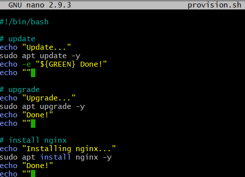

# Creating a script in bash
In this section, we will be creating script files to help with automation within Linux
A scritpt file is a file that is filled with linux commands. 
Before filling out this file with shell commands you must test to see that your commands are working.
Test out each command and then put those commands into a scriprt 

## How to create a script
.sh - is a script file 

Assuming you have logged into your virtual machine, and are able to run linux, Its should now be easy for you to create a new file.
Use the Nano command to do this and name the file provision.sh.
this will create a new file and open the text editor.
Please note that you do not need to use a touch command to create a new file if you are definitely going to append to the empty file stated in the nano command.

```
#!/bin/bash/
```
The line stated above is to be used at the beginning of every BASH file which tells the runner to go and find a BASH interprater using the given path.
The rest of the file is used for your commands. Look at the following screenshot.



This screenshot shows a list of commands that will install the nginx web server using terminal.
As a devops engineer, one thing you must always do is test all of your commands before putting them into a script. 
Before putting these into a nano editor we tested these commands individually:
1. sudo apt update -y will update every package within the list of packages in 


