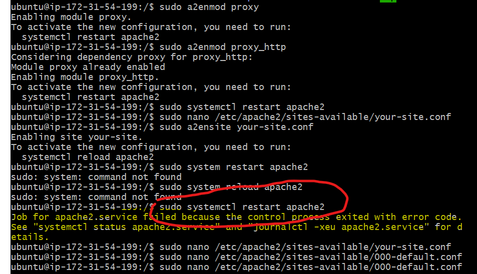
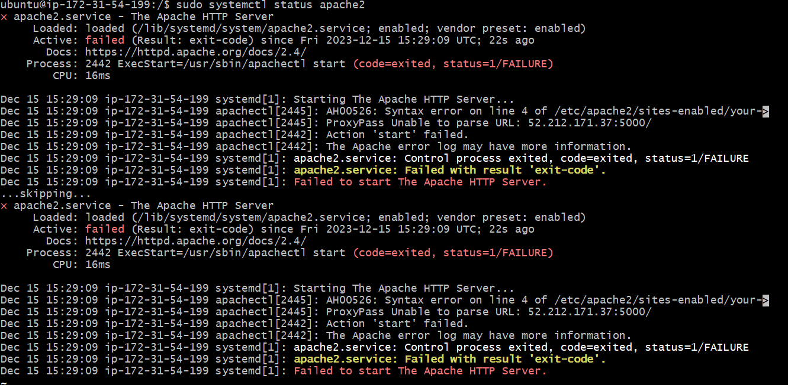
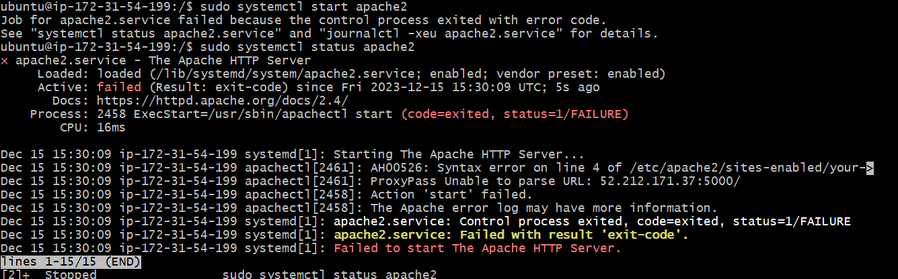

# Running data faster

## We can create AMI - Amazon Machine Image 
This is a snaphot of your disk
It will make running eerything faster. 
We are going to take a compolete snapshot of the disk of a running app

Steps to get a snapshot of the disl

1. go to the running instance and t
2. press actions
3. Images and Templates
4. Create Machine image
5. On the create image page
    1. Enter an image name: tech242-Artie-ready-to-run
    2. Enter a decription saying: Linux 22.04 Lts, maven, JDK 17, APP FOLDER
    3. move down to the tag section
       1. key: name, Value: tech242-Artie-ready-to-run
    4. Press Create Image
6. Takes us back to the instance: press the Ami link in the green box at the top
7. It will show your AMI id
8. When you find your own ami, you can press it once available and then press Launch instance from AMI
9. Then go into user data for the ami and type

#!/bin/bash
cd repo/springapi
sudo mvn spring-boot:start

10. Run the AMI
   
Although faster than just launching an EC2 instance with user data, the level of automation is slightly less that userdata
Then the thing will be 


<VirtualHost *:80>

    ServerName 52.212.171.37
    ProxyPass / 52.212.171.37:5000/
    ProxyPassReverse / 52.212.171.37:5000/

</VirtualHost>

## Installing apache
So far we've had to log into the working website that we created by typing in our ip address and then stating that we are on port 9000.
The problem with this is that if we dont know the server ip address then it becomes problematic as we have to go to AWS to get that. Here is where apache helps us.
We can configure it to intercept the contents of the port that we are using (5000) and uses it to map to the correct end points. This means that the user doesn't have to worry about knowing what Port number to put in to access the website.

This was an independent task that we were asked and with the aid of chatgpt, the following steps were initially followed. Please note that this script caused an errour that is shown at the end of the following code snippet:

```
sudo apt update
sudo apt install apache2
sudo systemctl start apache2
sudo systemctl enable apache2

#optional
sudo systemctl status apache2

sudo a2enmod proxy
sudo a2enmod proxy_http
sudo systemctl restart apache2   # For Ubuntu/Debian

sudo nano /etc/apache2/sites-available/your-site.conf

######################### within the nano file 
<VirtualHost *:80>
    ServerName your-domain.com

    ProxyPass / http://backend-server-ip:backend-port/
    ProxyPassReverse / http://backend-server-ip:backend-port/
</VirtualHost>
#########################
Replace your-domain.com with your actual domain name or IP address.

Replace backend-server-ip and backend-port with the IP address and port of your backend server.

sudo a2ensite your-site.conf  
sudo systemctl restart apache2 


```

The Error:



Apache 2 status error



Starting apache again error:




At this point I called the team and we edited the commands to the following after apache was installed. It involved deleting the original conf file that we had created (your-site.conf)

1. In the root directory type, sudo nano /etc/apache2/sites-available/000-default.conf
2. Then type this into the conf file:


3. Once you are done with the conf file save it and then type in the following commands

```
ubuntu@ip-172-31-54-199:/$ sudo rm etc/apache2/sites-available/your-site.conf
ubuntu@ip-172-31-54-199:/$ sudo systemctl start apache2
ubuntu@ip-172-31-54-199:/$ sudo systemctl status apache2

```

4. Your new AMI should be running and it is now time to script it

