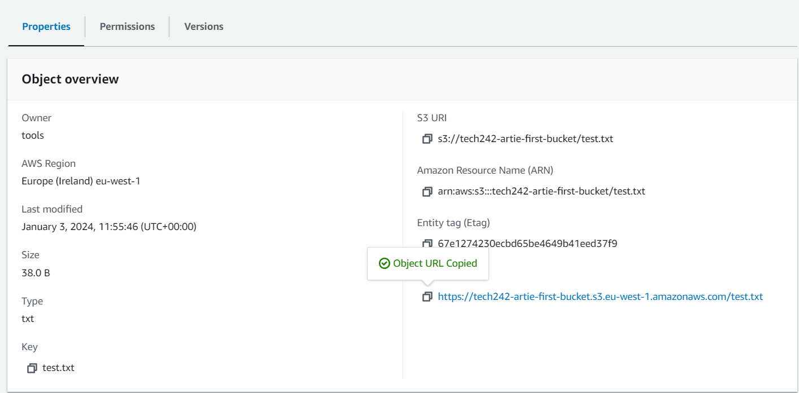
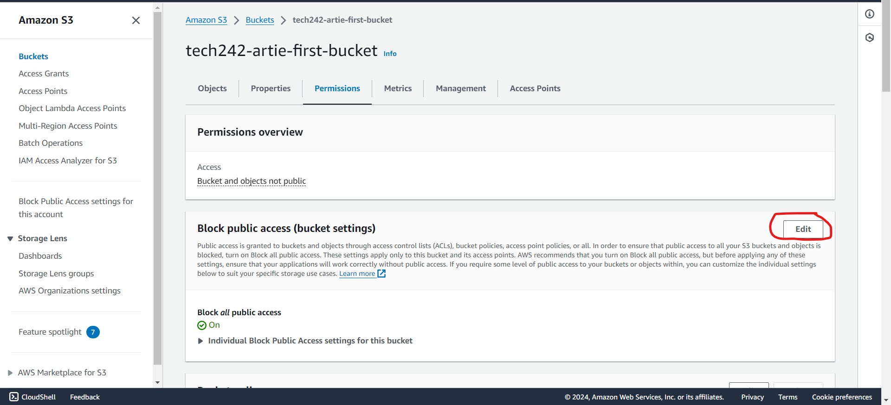
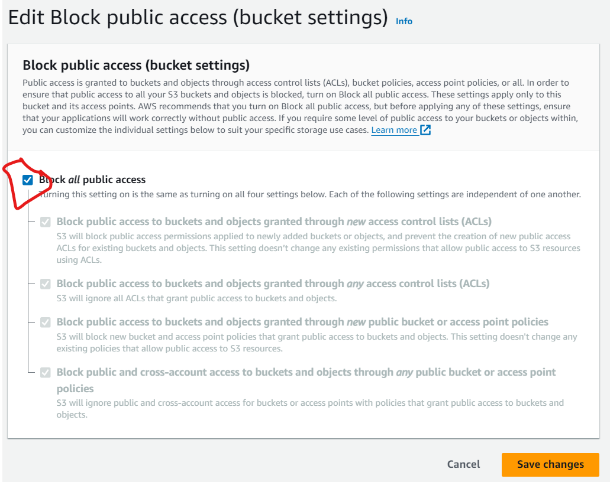
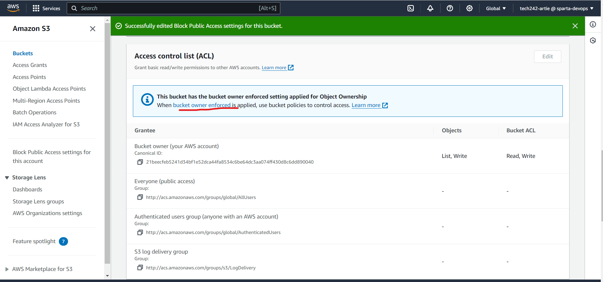
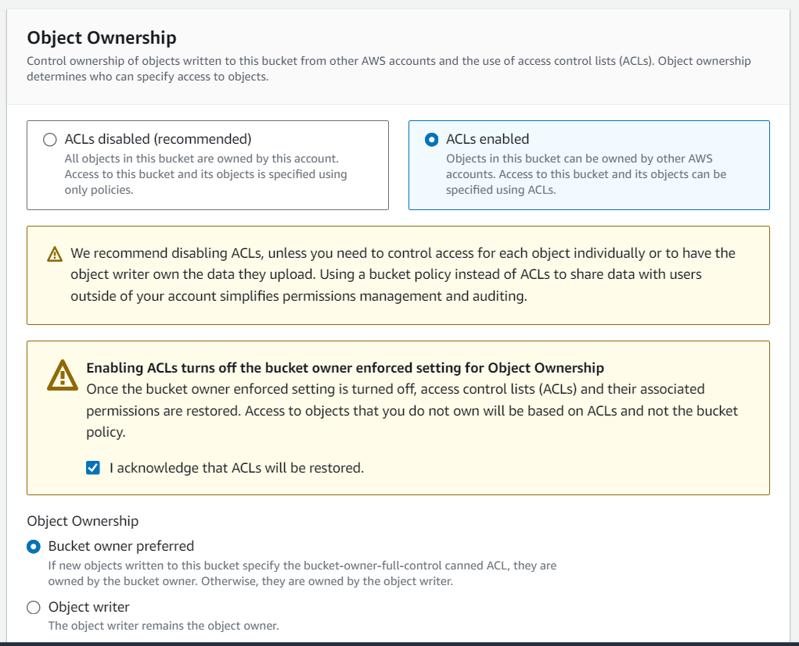

# S3 images
This is an AWS component that allows for blob storage.
bucket in AWS is a container in Azure
You can store images files in the bucket and those can be used at your will on other VMs and this section will show how to do that

## Steps

##### Step 1
Search s3 and you will see all of the folders (Buckets is the actual term)
When you click on one bucket, you will see all of its content. e.g. a cat.png in "tech242-ramon-images"

For this example we ran the [script for JSON Vorhees](../../Scripts/MySSHScript-json-vorhees.md) on a new vm in user data
then we did the following commands:
**Do not do this in root directory** 
**You cannot log in as root so always go into the home directory**

```
sudo apt install awscli -y      # [Debian front end this] but not essential
aws --version

aws configure # here it asks for your access key ID and your secret access key
eu-west-1     # default region 
json          # default output format 
aws s3 -ls    # lists all of the buckets
aws s3 help   # When its a subsection of a command you can just type in help
q             # Quits the help interface 
aws s3 mb s3://tech242-artie-first-bucket                   # Makes the bucket NO CAPS
aws s3 ls s3://tech242-artie-first-bucket                   # Lists the content of the bucket
echo This is the first line in a test file > test.txt
aws s3 cp test.txt s3://tech242-artie-first-bucket          # Adding the test.txt to s3 bucket

aws s3 sync s3://tech242-artie-first-bucket .               # Download the content of the bucket into current directory
aws s3 rm s3://tech242-artie-first-bucket/test.txt          # removes singular file from the bucket
aws s3 rm s3://tech242-artie-first-bucket --recursive       # removes all files in a bucket
aws s3 rb s3://tech242-artie-first-bucket
aws s3 rb s3://tech242-artie-first-bucket --force           # removes the buckets and the contents

```
##### Accessing content within the bucket
Now that we know how to add and remove files from a created bucket all through the CLI, we now want to be able to access the photos within the bucket
1. Select the file within the bucket that you want to open
2. Select the URL 


access control list - controls the permissions for individual files
- scroll to access control list
- youll notice that you cant press edit so you press the link

3. If you get an error when you search this URL on the browser, it is because the file doesnt give the correct access permissions. To change this, you must go to the bucket and press permissions





The file should now be openable using the previous URL

4. Now that the file can be browsed we can change the image on JSON Vorhees using the following command in our running VM

