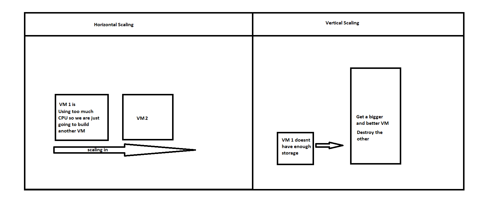

# Autoscaling
Now we know how an AMI works and how to create one. We need to understand the following diagram.

The diagram is an illustration of the differences between Horizontal scaling and vertical scaling. 
Horizontal scaling is when a VM that is over exherted is terminated and replaced by a newer one with more available power. This is called scaling in(Today wewill be doing this).
When a VM is not powerful enough, we scale vertically (normaly upwards) and this is when you upgrade VM based on specific features for example, size.

## Roadmap
The goal of all of this is to maximise the uptime of the now infamous JSON Vorhees application. 

Look at the image below:

Thus far, we have created our VM and our AMI. The instances of the AMI are all running the app but we want to terminate these and do the following
1. Launch templates
2. Create an Auto-scaling group(ASG) based on that template. The ASG in this example will have2 virtual machines as a minimum and a desired amount of 2 VMs and a maximum amount of 3 VMs running simultaneously. We will monitor the CPU usage of each machine then if the CPU usage exceeds 50%, it will create another VM.
3. So now within our Ireland region, we will have 3 availability zones 1 for each VM so that is one goes down our data doesnt jus disappear.
4. A load  balance will direct user traffic to one of these virtual machines based on their CPU usage

Here are the screenshots of how to complete the states steps
## Step 1 - Launching a template based on an AMI

### 1.1 Launching a template

### 1.2 Launching template options

