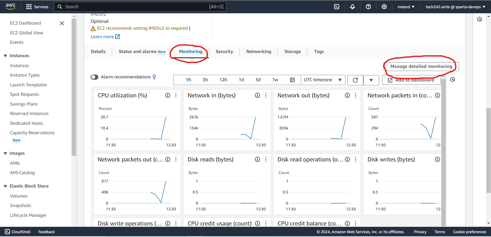
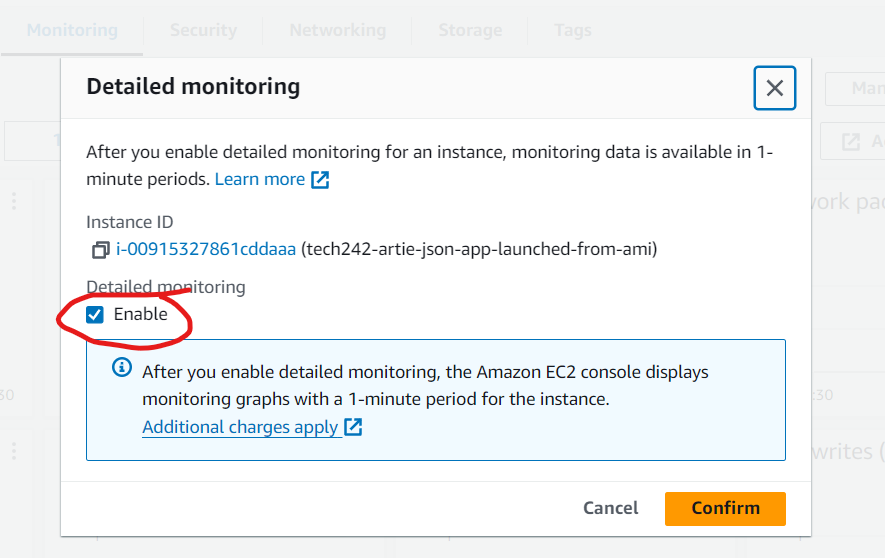
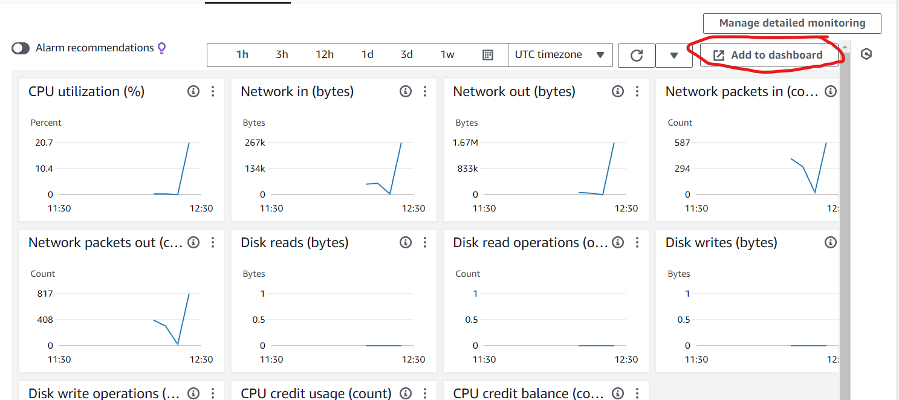
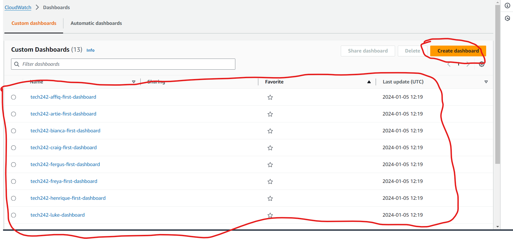

# Monitoring
Let's imagine 4 different VMs. We can monitor 3 them and assess their CPU usage. 
metric is a specific aspect that can be monitored like memory

### VM1 - Worst case
we have an app vm with NO MONITORING - we decide to monitor cpu load which happens to be too high - everything can fail at that point 

### VM2 - CloudWatch(AWS monitoring system)
CloudWatch decides to monitor the CPU Load 
CloudWatch uses a dashboard and that requires constant monitoring

### VM3 - CloudWatch Monitoring CPU
CW Monitoring is monitoring the cpu load
When a metric exceeds a desired treshold then an alarm will be triggered
You must decide how that Alarm gets triggered
On this day we will get an email notification when a metric is exceeded

### VM4 - Cloudwatch monitoring cpu
The VM doesnt send a notification and then the user but just deals with the metric excession automatically
consider the cost
this is called autoscaling

# Creating a dashboard (VM2 Scenario)
Go to the instance details and then press the monitoring tab halfway down the page
enable detailed monitoring
This costs more but it is more detailed

YOU MUST change the charts too

## Create a dashboard
press add to dashboard and then press create new
### Step1

### Step2

### Step3

### Step4

### Step5

### Step6
