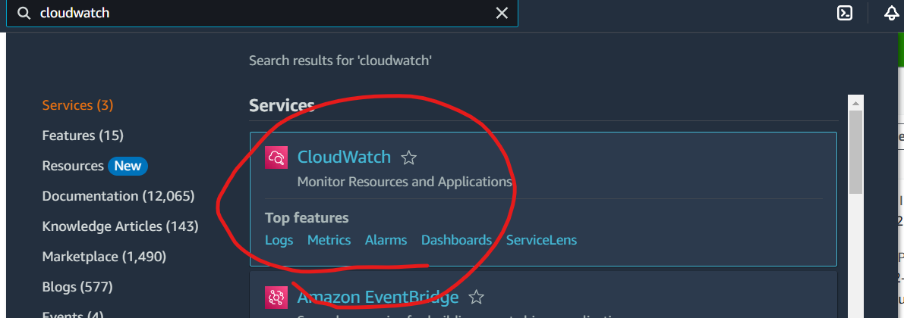
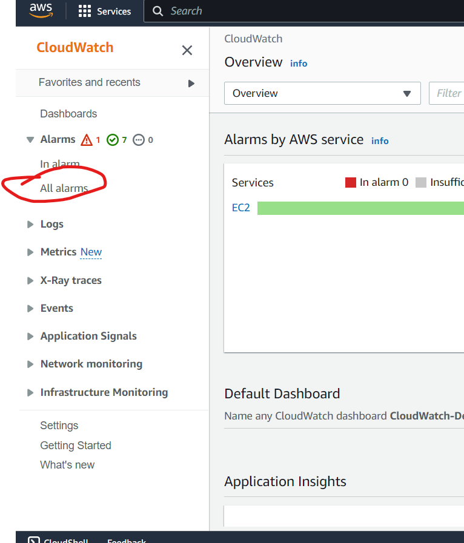
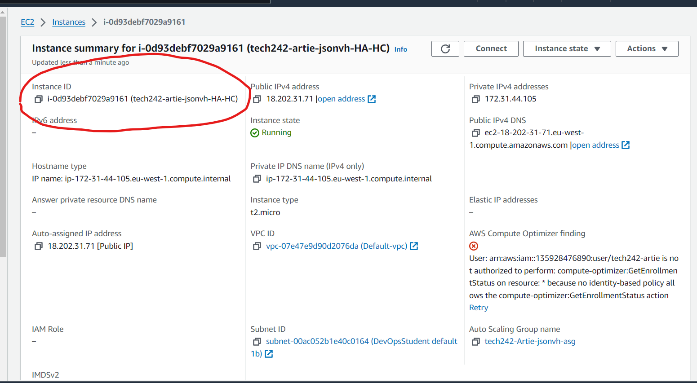
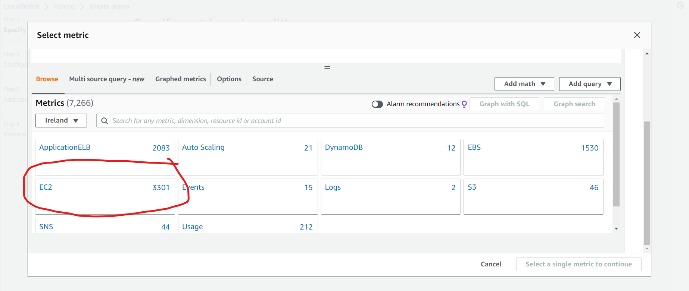
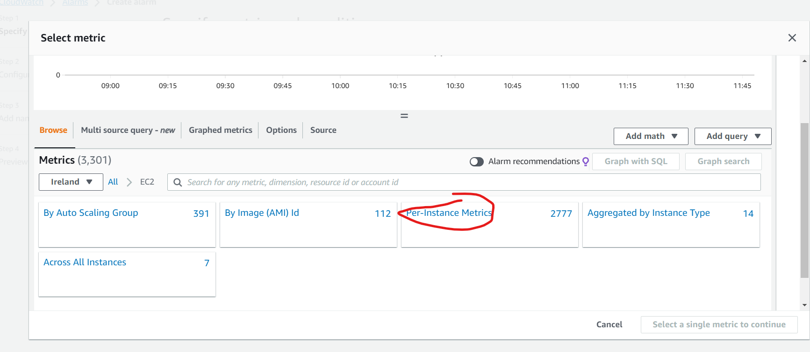
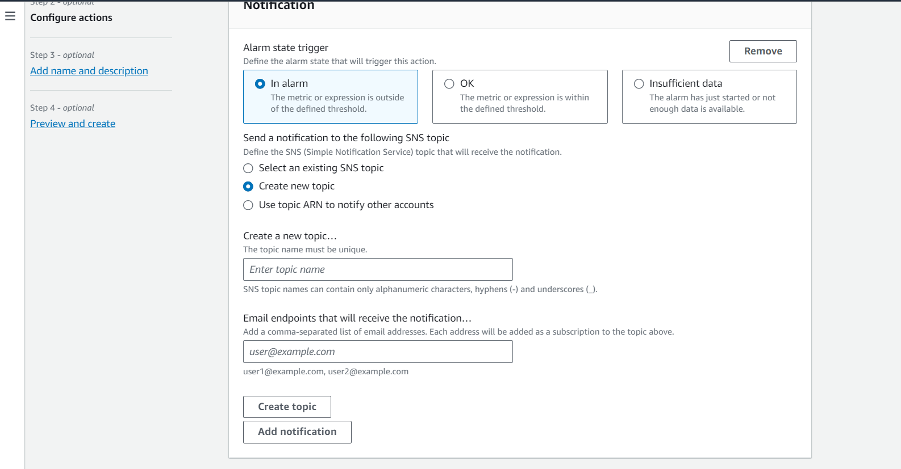
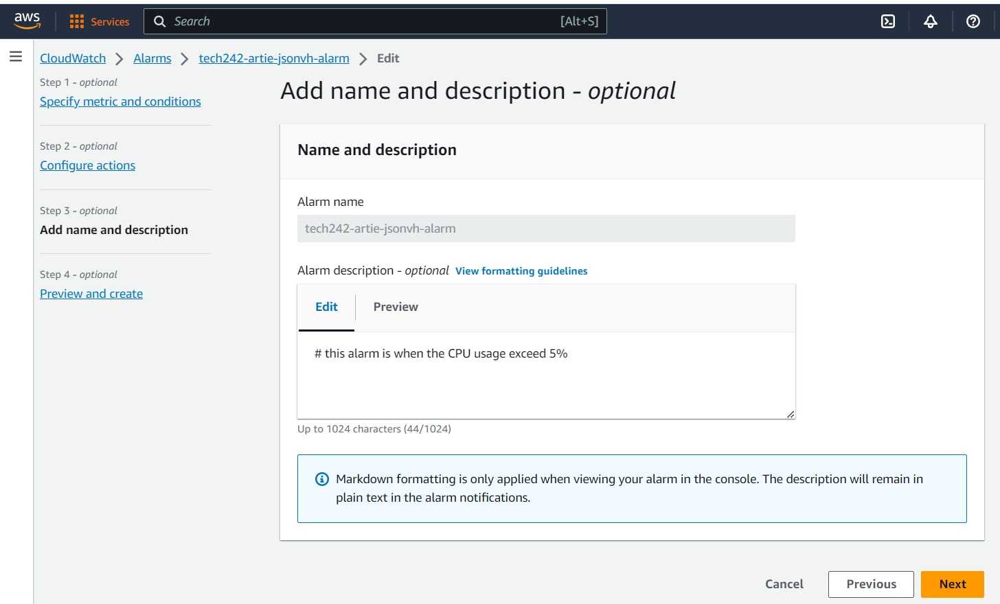
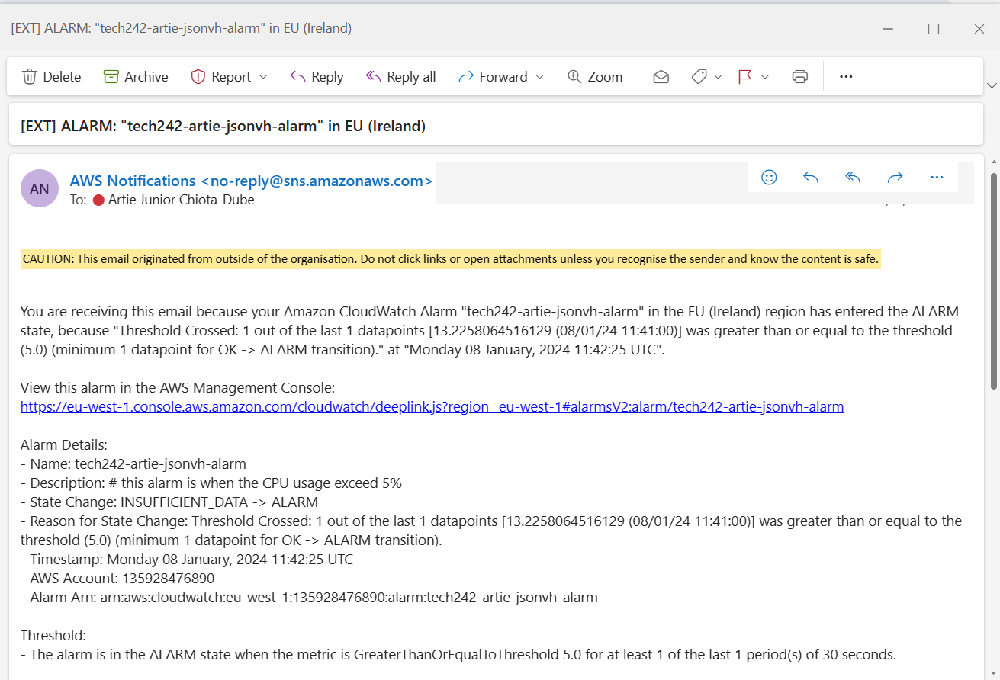

# Alarms
Alarms are used to inform the operator when a VM has exceeded a metric that they are monitoring.

It is a relatively simple process to follow:
1. Create an alarm 
2. Let it monitor an EC2 Instance 
3. Set up an email subscription service for the alerts to go to
4. Use the VM and you will get the CPU to trigger the alarm successfully.

The Steps are as follows
## Step 1: Search CloudWatch on the EC2 instance

## Step 2: Select All Alarms

## Step 3: Select Metrics
Metrics are a paramiter, the value of which are going to be used to trrigger the alarm. In this case the CPU utilisation.
### 3.1

### 3.2
**Remember:** Copy the Instance ID from the instance page so that you know what instance youre monitoring.

## 3.3

## Step 4: Specifying metric conditions

## Step 5: Configuring the actions

### Step 5.1: Creating an email subscription list
**Make sure you enter the email correctly**

## Step 6: Setting the description

## Final result
With the app running, I ran many commands very fast, 

