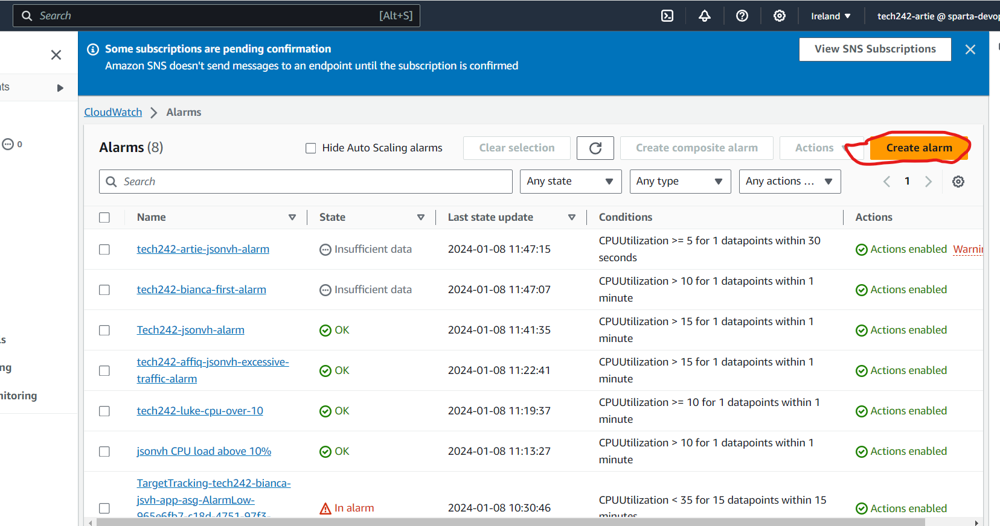

# Alarms
Alarms are used to inform the operator when a VM has exceeded a metric that they are monitoring.

It is a relatively simple process to follow:
1. Create an alarm 
2. Let it monitor an EC2 Instance 
3. Set up an email subscription service for the alerts to go to
4. Use the VM and you will get the CPU to trigger the alarm successfully.

The Steps are as follows
## Step 1: Search CloudWatch on the EC2 instance

## Step 2: Select All Alarms

## Step 3: Selecting the metrics
This is done to choose a metric to watch. 

**Remember:** Copy the Instance ID

