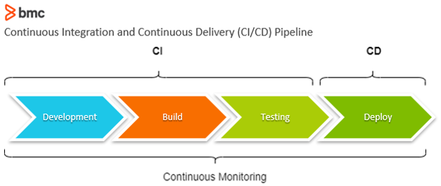

- [CICD](#cicd)
  - [Continuous Integration (CI) Explained](#continuous-integration-ci-explained)
  - [Continuous Delivery (CD) Explained](#continuous-delivery-cd-explained)
  - [Continuous Delivery (CD) vs. Continuous Deployment (CDE)](#continuous-delivery-cd-vs-continuous-deployment-cde)
    - [Continuous Delivery (CD)](#continuous-delivery-cd)
    - [Continuous Deployment (CDE)](#continuous-deployment-cde)
      - [Summary](#summary)
- [Jenkins](#jenkins)
  - [Jenkins Explained](#jenkins-explained)
  - [Benefits and Disadvantages of Using Jenkins](#benefits-and-disadvantages-of-using-jenkins)
    - [Benefits:](#benefits)
    - [Disadvantages:](#disadvantages)
  - [Stages of Jenkins Pipeline](#stages-of-jenkins-pipeline)
  - [Alternatives to Jenkins](#alternatives-to-jenkins)
- [Pipelines](#pipelines)

# CICD

## Continuous Integration (CI) Explained

CI stands for Continuous Integration.

**Analogy:** Imagine you and your friends are making a big LEGO project together. Each friend builds their own part, right? Now, let's say you all decide to connect your parts to make a huge castle. But before putting it all together, wouldn't it be cool to check if each part fits well and works properly?

That's what CI does but with software instead of LEGOs! It's like making sure that every piece of code your team writes works well with the others. So, instead of waiting until the end to find out something's wrong, CI helps by checking each piece of code regularly, like building blocks, to make sure they fit and work together smoothly. This way, problems are caught early, and the final software is more likely to be solid and work great.

## Continuous Delivery (CD) Explained

CD stands for continuous delivery

**Analogy:** Imagine you've made an awesome birthday cake. Now, you want to get it to the party without any mess and ready to serve, right?

Continuous Delivery is a bit like that. After you've built and tested your software using Continuous Integration (CI), CD helps to package it up neatly, making sure it's all set to go. Just like putting the cake in a nice, secure box for transportation.

But here's the cool part: CD doesn't just stop at packaging. It's like making sure the cake gets to the party on time and in perfect shape. In software, it means getting your tested and working code ready to be sent out to users whenever you're ready, smoothly and without any hiccups. It's like having a system that helps you deliver your software, all decorated and ready to enjoy, whenever you want.

## Continuous Delivery (CD) vs. Continuous Deployment (CDE)

### Continuous Delivery (CD)
Imagine making a fantastic cake and ensuring it's perfectly packed and ready for the party. CD is similar. It's about taking your tested software (which you've made sure works well through Continuous Integration) and getting it all nicely packaged and prepared for delivery. Just like putting the cake in a secure box, CD gets your software ready to be sent out whenever you want, smooth and hassle-free.

### Continuous Deployment (CDE)
Now, think about the cake not only being packed but also instantly appearing at the party as soon as it's ready. CDE goes a step further than Continuous Delivery. It takes the tested and packaged software and automatically sends it out for use by users without any manual steps. Like a magical cake that shows up at the party without anyone having to carry it there.

#### Summary
Continuous deployment is a faster variation of Contiuous delivery and insures quick delivery of quality code at all times

# Jenkins
## Jenkins Explained

Hey there! Imagine having a super helpful robot friend named Jenkins. Jenkins is like a cool butler for computer stuff. You know how you might have a list of chores to do every day? Jenkins does that for computer tasks!

So, when teams of people are building awesome software, they write lots of code every day, just like doing different chores. Jenkins steps in and says, "Hey, I can help with that!" It takes all the pieces of code everyone's working on, checks if they fit together nicely, and makes sure they work well without any problems. Just like a butler making sure everything's in order.

But here's the really neat part: Jenkins doesn't get tired! It keeps checking the code all the time, day and night. And if it finds something wrong, it tells the team right away so they can fix it. It's like having a super reliable robot friend making sure everything stays smooth and working perfectly in the world of computer programs.

## Benefits and Disadvantages of Using Jenkins

### Benefits:

1. **Automation:** Jenkins automates repetitive tasks, saving time and reducing errors.
2. **CI/CD:** Facilitates Continuous Integration and Deployment for smoother development.
3. **Extensibility:** Customizable through a wide range of plugins.
4. **Community Support:** Large user community contributing to updates and knowledge.
5. **Ease of Use:** User-friendly interface suitable for various skill levels.

### Disadvantages:

1. **Resource Intensive:** Consumes substantial system resources.
2. **Complex Setup:** Initial setup might demand technical expertise.
3. **Maintenance Overhead:** Requires ongoing attention for updates and stability.
4. **Security Concerns:** Improper configuration could pose security risks.

## Stages of Jenkins Pipeline

1. **Checkout:** Fetches the source code from version control.
2. **Build:** Compiles, validates, and prepares the code for testing.
3. **Test:** Runs various tests to ensure code quality.
4. **Analysis:** Conducts static code analysis for issues or vulnerabilities.
5. **Deploy:** Deploys the code to specific environments like staging or production.
6. **Release:** Involves tasks related to officially releasing the software.
7. **Cleanup:** Handles post-deployment tasks such as removing temporary files.

## Alternatives to Jenkins

1. **GitLab CI/CD:** Integrated within GitLab, it offers seamless CI/CD pipelines, version control, and project management tools in a single platform.

2. **CircleCI:** A cloud-based CI/CD platform that focuses on simplicity and speed, providing customizable pipelines and extensive integration options.

3. **Travis CI:** Known for its ease of use, especially for open-source projects, Travis CI supports GitHub integration and provides a straightforward configuration.

4. **TeamCity:** Offered by JetBrains, it's known for its user-friendly interface, scalability, and comprehensive CI/CD features.

5. **GitHub Actions:** Integrated directly into GitHub, it enables automated workflows triggered by various events in repositories.

6. **Bamboo:** Developed by Atlassian, Bamboo provides CI/CD capabilities, especially suited for teams using other Atlassian tools like Jira and Bitbucket.

7. **Azure DevOps (formerly known as VSTS):** Offers a suite of tools for CI/CD, project management, and collaboration, deeply integrated with Microsoft's ecosystem.

# Pipelines

Imagine you're in charge of making your favorite pizza. A pipeline is a lot like your recipe for making that awesome pizza.

So, when you make a pizza, you follow steps, right? You start with the dough, add sauce, cheese, and toppings, then bake it. Each step is important to get a perfect pizza.

Now, think of a pipeline in business or software as a set of steps just like your pizza recipe. But instead of dough and toppings, it's a series of tasks to make sure everything in a project gets done smoothly.

Why build a pipeline? Well, imagine making lots of pizzas at a restaurant without a recipe. Chaos, right? A pipeline helps avoid chaos by organizing tasks in a clear order. For businesses, it's about organizing tasks in a project: coding, testing, fixing, and delivering software, just like your pizza steps.

The business value is huge! It saves time, reduces mistakes, and helps everyone work together better. Like making pizzas efficiently at a restaurant, a good pipeline helps businesses deliver products or services faster, with better quality, and everyone knows what they need to do. It's like having a recipe for success!

Image from: https://www.google.com/url?sa=i&url=https%3A%2F%2Fwww.bmc.com%2Fblogs%2Fwhat-is-ci-cd%2F&psig=AOvVaw1uQlEE-SclnyYPMaY32af3&ust=1704815926897000&source=images&cd=vfe&opi=89978449&ved=0CBQQjhxqFwoTCOj44LKUzoMDFQAAAAAdAAAAABAI