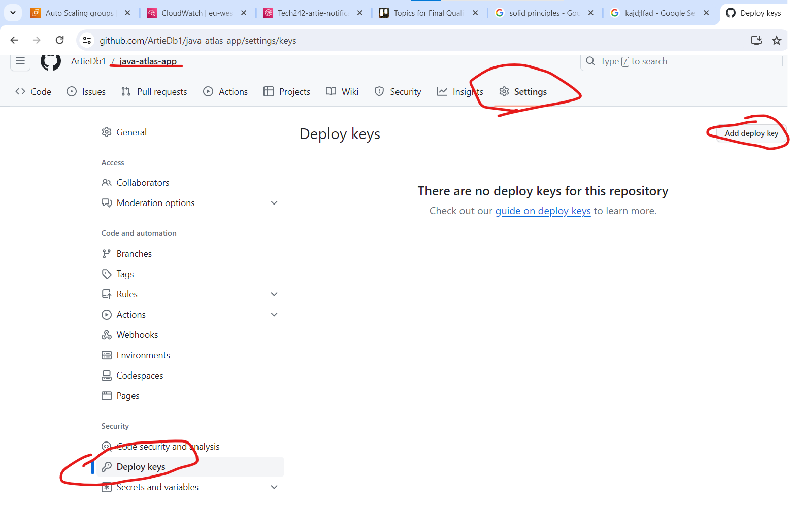
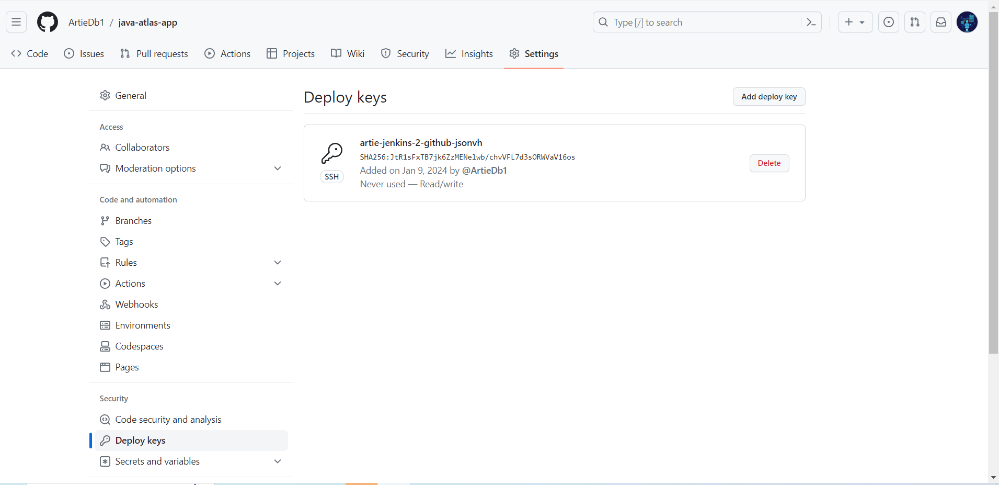

# Jenkins
Jenkins is a very powerful tool that helps release software from an initial push on github to a fully functional VM that runs your app. It allows for Continuous deployment of an app


Jenkins waits for any notification of a change on the dev branch on git hub

## Step 1: Setting public key for github
We give the public key so that Jenkins with the private key can unlock github with the public key

1. open git bash

This is so that we have a key from jenkins to the repo

```
cd ~/.ssh
ssh-keygen -t rsa -b 4096 -C "artiedube7@gmail.com"
 artie-jenkins-2-github-jsonvh
```
1. go to the json vh repo on github and press **settings**
2. press **Deploy keys** and add a key
3. add the public key to the box and press enable




Here is the command:
```
cat artie-jenkins-2-github-jsonvh.pub
```


###### End of Step 1 Your screen should look like the following


## Step 2: Start Jenkins service

1. You were given credentials to log into Jenkins so use them to log in.


### 2.1: Creating a job
Lets create our job


Naming the job:


Every time you run a job, it creates a build!
Remember to limit the builds to 3.


If you forget to do this, then press configure on your job after finding it at the dashboard


Scroll down to build steps, press **Execute shell**
Type in the following command 
```
uname -a
```


Press Save! 
### 2.2 Building the job
Go to the dashboard then build the job.


Look at the image below the Executor status part says idle because there are no jobs running. 
They do build up eventually to show all of the jobs that are running 

## Step 3: Seeing the output of the command line


We can see here that the command line successfully processed our command 

## Build A pipeline of jobs
To build a pipeline you must manipulate the post-build tasks by configuring the job.


Type in  the name of the other job that you want to build after this one is complete 


I decided to configure the bost build steps of my first job


Now look at the next 2 images.
The 2 jobs executed concurrently. I have underlined the times that they finished executing to illustrate how a pipeline works