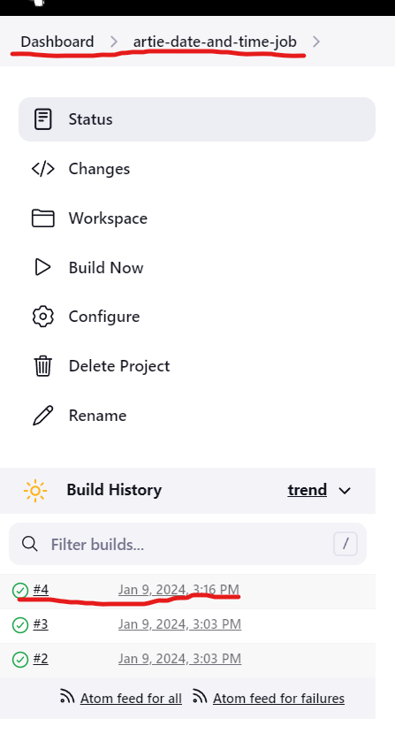
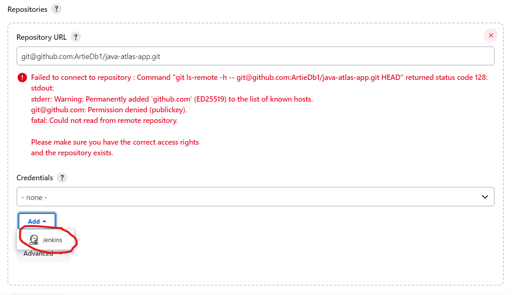
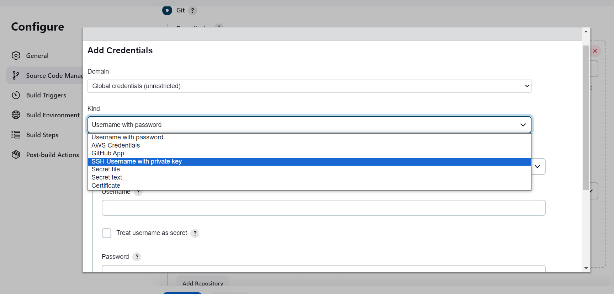

# Using Jenkins To Create a Pipeline of Jobs
## Background
Think back to [yesterday](../Day2/Jenkins.md) where we saw how to create a very basic pipeline. We ran 2 jobs that were completed in very quick succession indicating a working pipeline: 

Today we will be creating a pipeline but to run the jobs for a complete deployment.

The steps are as follows:
## Step 1: Creating the Jobs

## Step 2: Giving Jenkins our private key

### 2.1
Scroll down to the console management section and select git
in the URL, use the Http URL given by the URL

You can see that at this pioint there is an error.
The error is because Jenkins doesnt have a private key to unlock the github padlock (public key)

### 2.2 Giving Jenkins our key
From the previous image, we saw that we have  to press **Add** and select **Jenkins**.
In the resulting window, fill out the **kind** section

### Ask Martin then Ramon or Sharukh