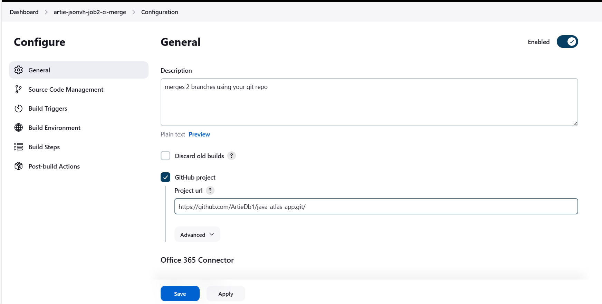
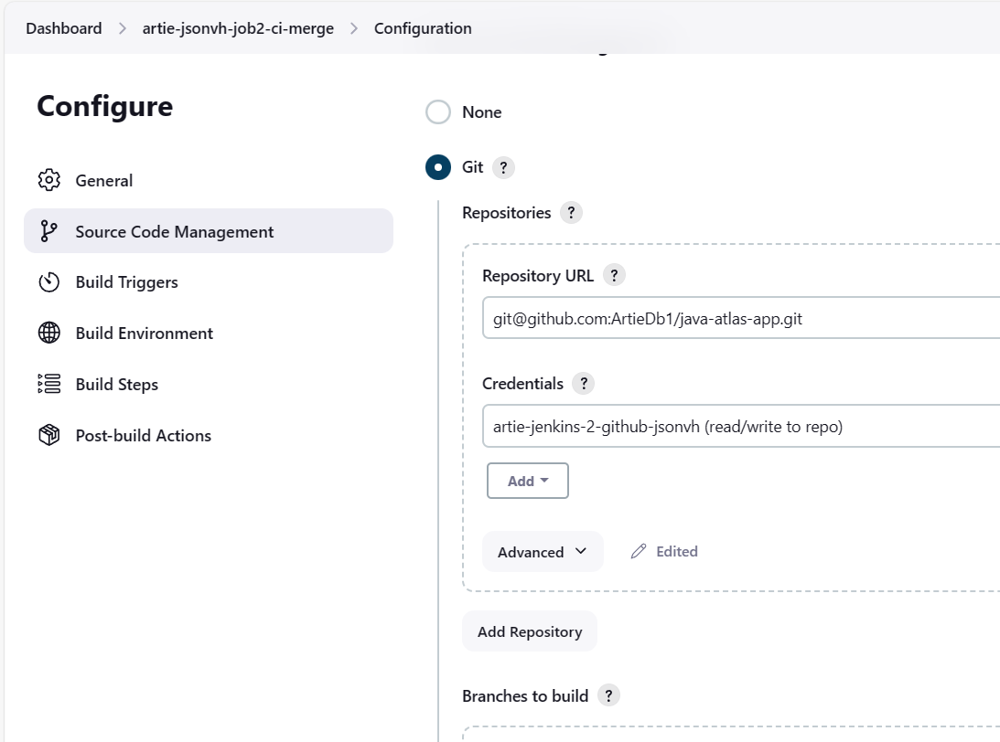
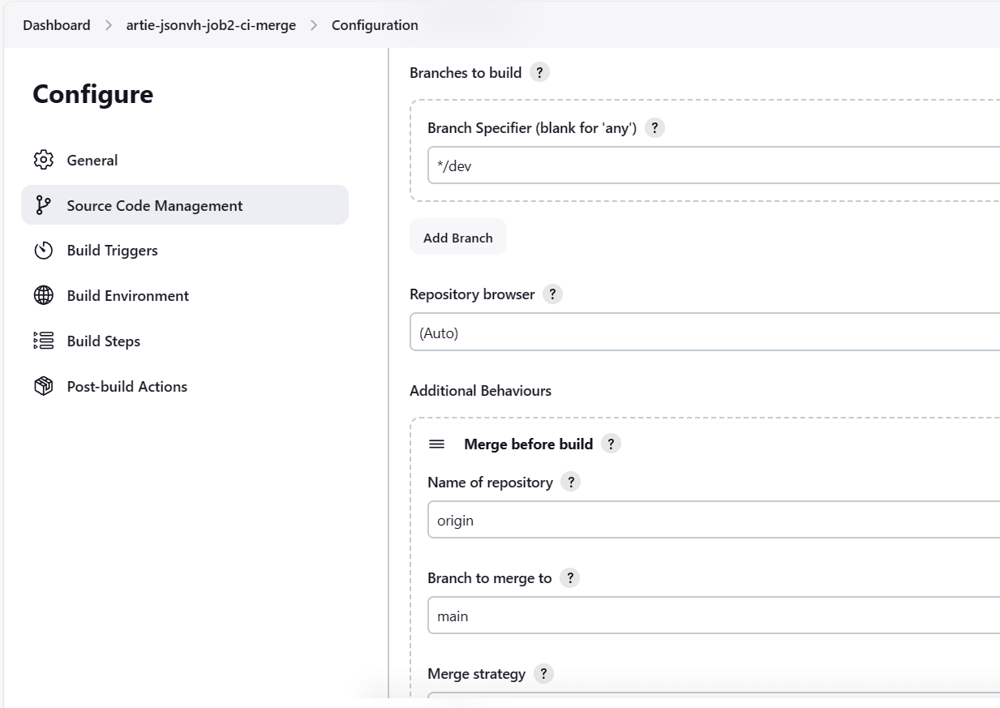
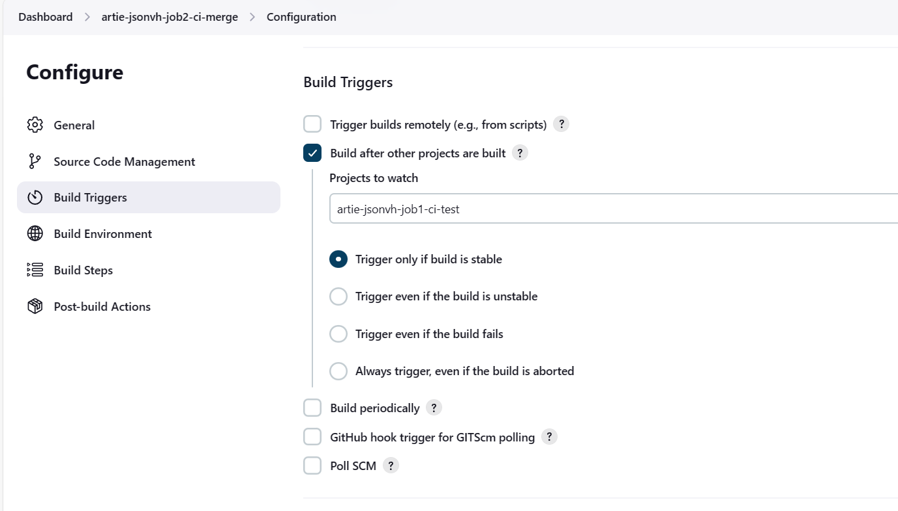
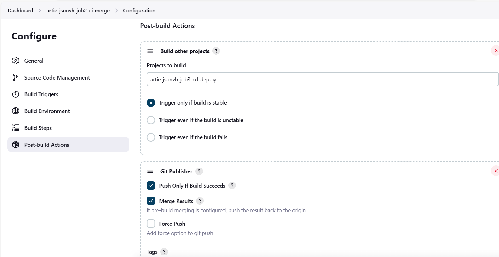
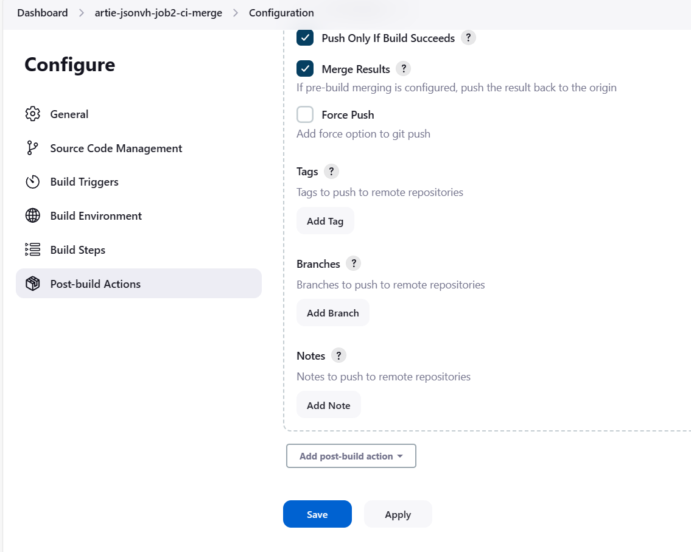

# Job 2 Jenkins Pipeline
In this job, I will be focusing on merging the changes from the Dev to the Main branch. I found that the issues here were that I had to manage merge request manually so to fix this blocker, I selected the git publisher, and force merged changes on the main branch.

The steps are as follows:
1. Create a job as done previously
2. Adjust the configuration settings Accordingly

## Configuration Settings:
### 1 - Connect your github project

### 2 - Specify the repo that the job concerns

### 3 - Configure the relevant branches that concern this job
Here we want the job to manipulate the dev branch.
Add additional behaviours and type in the branch that you want to merge into.
For the merge strategy, select ff 

### 4 - Configure your build triggers
You want this job to trigger only after the first job has finished and successfully built.

### 5 - Configure the build Steps 
This step assumed that Job 3 was already created. At this point it was created due in order to have a fully working pipeline for the deadline but the pipeluine want completely automated.

### 5.5 Configure the force merge 
To make this a fully automated pipeline, I had to use the git pulisher to force merge the dev branch into the main branch.

## End of Job
The aim of this job was to merge the dev branch and the main branch automatically after Job 1 was complete. To test this, I made a change within the project on the dev branch in git hub and watched the main branch mirror thos changes after the completion of job 2.