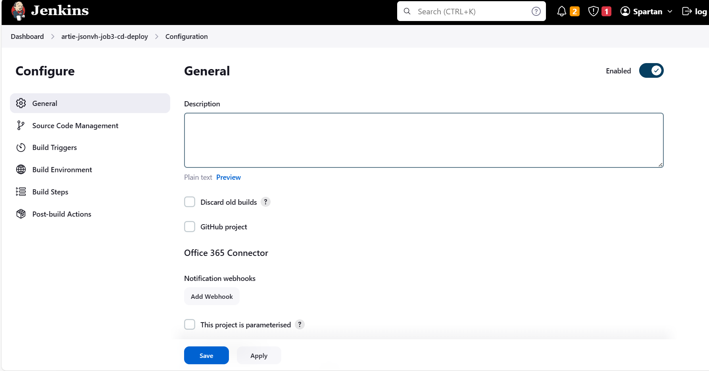
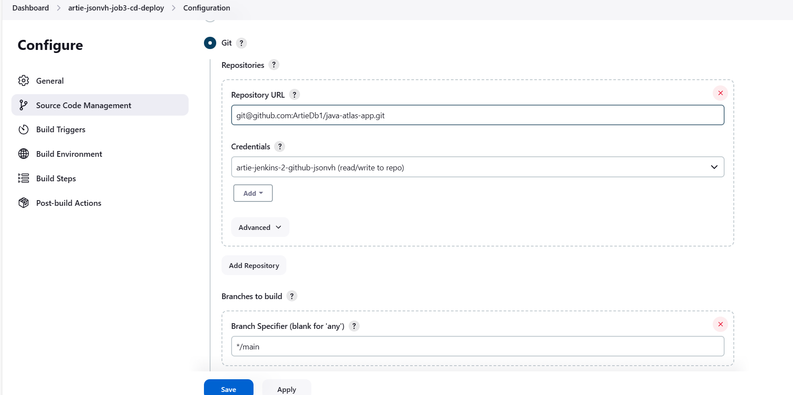
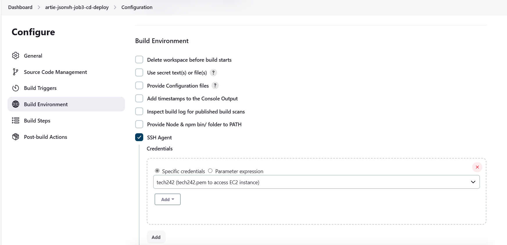
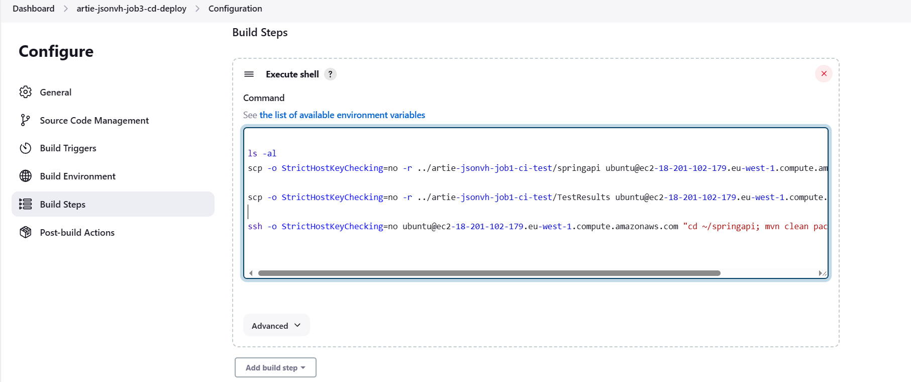
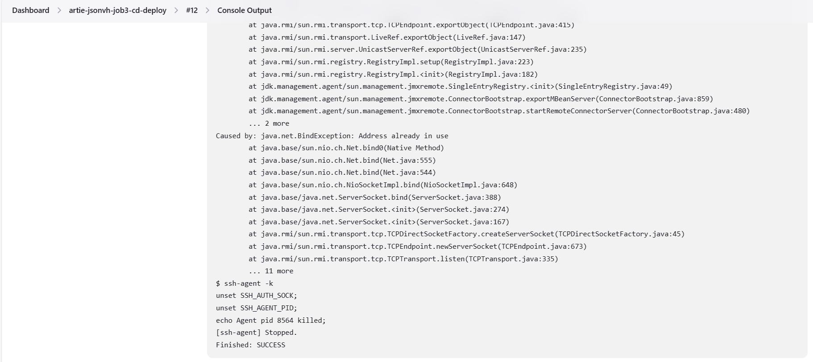

# Job3 Jenkins Pipeline
At this point Job 1 and 2 are finished and the pipeline is almost complete. After an initial push to the GitHub dev branch, the changes are then automatically merged to the GitHub main branch. In this job we will be looking at running this on a virtual machine from AWS.
To do this we need to create a VM from Amazon either from the AMI we created when deploying the Java atlas app (JSON Vorhees) or, we create a new instance with maven dependencies entered in user data. The user data looked as so:
```
#!/bin/bash
cd repo/springapi
echo "Starting"
mvn spring-boot:start
```

This will start the app from the AMI and now with a running app, we will need to connect to it and send our changes from github to the the new virtual machine.

Just make sure that the security groups allow http from any IP

## 1 - General


## 2 - Source code management


## 3 Build environmentConfiguration
Remember the post build steps of job 2 were to trigger job 3 so we dont have to worry about having build triggers.



## 4 - Build Steps:
Press execute shell.
We will now log into the VM and put the updated code into it then run the VM



```
scp -o StrictHostKeyChecking=no -r ../jsonvh-job1-ci-test/springapi ubuntu@ec2-18-201-139-56.eu-west-1.compute.amazonaws.com:~


scp -o StrictHostKeyChecking=no -r ../uyi-jsonvh-job1-ci-test/TestResults ubuntu@ec2-18-201-139-56.eu-west-1.compute.amazonaws.com:~

ssh -o StrictHostKeyChecking=no ubuntu@ec2-18-201-139-56.eu-west-1.compute.amazonaws.com "cd ~/springapi; mvn clean package spring-boot:start"
```

The following command came from the ssh command provided by Amazon when you what to ssh into a machine
```
ubuntu@ec2-18-201-139-56.eu-west-1.compute.amazonaws.com:~

```

## 5 - Final result 


Following the push from github, the pipeline should have now run and should start this job automatically. Upon entering this job, if everything has been done correctly, the console output of this current job, will be as follows shown above.
The change made initially was to update the time shown the home-page. 

